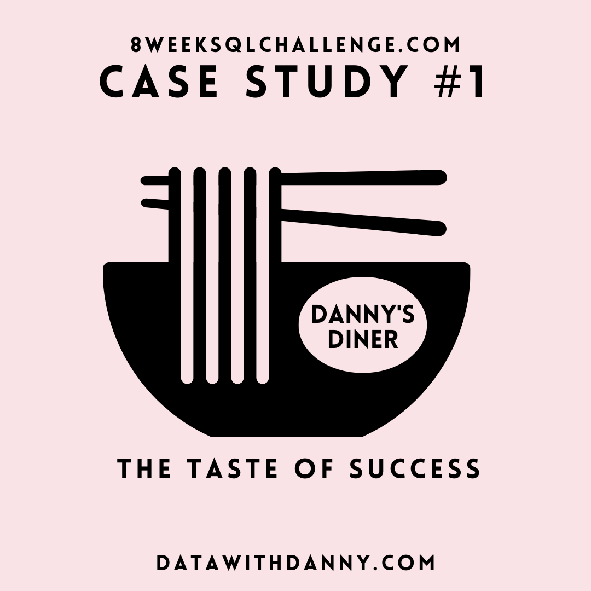
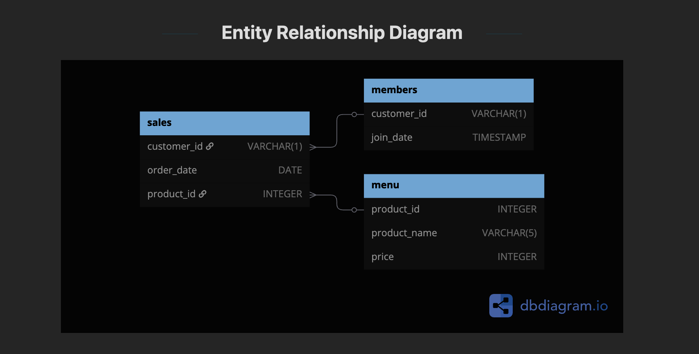

# 8-Week SQL Challenge - Case Study #1: Danny's Diner

## 📌 Overview
This repository contains my solutions to **Case Study #1: Danny's Diner** from the [8-Week SQL Challenge](https://8weeksqlchallenge.com/case-study-1/). The case study explores customer behavior using SQL queries on a fictional Japanese restaurant's database.

## 📊 Case Study Background
Danny's Diner wants to analyze customer transactions, loyalty points, and menu items to understand customer behavior and improve business operations. The data consists of three tables:

- **sales**: Records of customer purchases with transaction dates.
- **menu**: Details about menu items and their prices.
- **members**: Information on customers who are part of the loyalty program.

## 📁 Dataset
### ERD Diagrame 



The dataset includes the following tables:

### `sales`
| customer_id | order_date | product_name |
|------------|------------|--------------|
| A          | 2021-01-01 | sushi        |
| B          | 2021-01-01 | curry        |
| C          | 2021-01-01 | ramen        |

### `menu`
| product_name | price |
|-------------|------|
| sushi       | 10   |
| curry       | 15   |
| ramen       | 12   |

### `members`
| customer_id | join_date  |
|------------|-----------|
| A          | 2021-01-07 |
| B          | 2021-01-09 |

## ❓ Business Questions
Danny wants insights into customer transactions and loyalty program impact. Some key questions include:

1. What is the total amount spent by each customer?
2. How many days has each customer visited the restaurant?
3. What was the first item purchased by each customer?
4. What is the most purchased item on the menu and its total revenue?
5. Which item was most popular for each customer?
6. Which item was purchased first by customers after joining the loyalty program?
7. Which item was purchased just before joining the loyalty program?

## 🛠️ SQL Queries & Solutions
Each question is answered using **SQL queries**, analyzing customer transactions and loyalty program effectiveness.

### Example Query: Total Amount Spent by Each Customer
```sql
SELECT s.customer_id, SUM(m.price) AS total_spent
FROM sales s
JOIN menu m ON s.product_name = m.product_name
GROUP BY s.customer_id
ORDER BY total_spent DESC;
```


## 🔗 References
- [8-Week SQL Challenge](https://8weeksqlchallenge.com/case-study-1/)
-
---
Feel free to contribute or suggest improvements! 🚀

