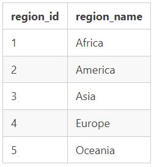
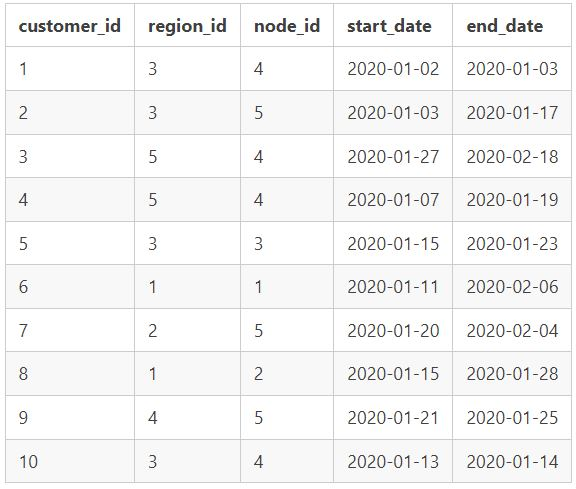
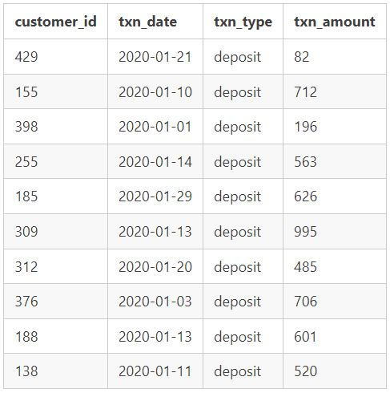

# 8-Week SQL Challenge - Case Study #4: Data Bank

## 📌 Case Study Overview

**Data Bank** is a digital banking service that provides customers with various transaction types, including deposits, withdrawals, and purchases. In this case study, we analyze customer transactions and derive insights into their banking behavior.

## 📝 Business Problem
Data Bank wants to better understand customer spending habits and transaction patterns. The key objectives include:
- Identifying trends in transaction amounts and types.
- Understanding customer banking behavior over time.
- Detecting potential fraud based on transaction anomalies.

## ERD  

## 📊 Dataset Overview

The case study includes three tables:

### Table 1: `regions`
This table contains the `region_id` and their respective `region_name` values. In a traditional banking sense, these regions function like bank branches or stores worldwide.

### Table 2: `customer_nodes`
Customers are randomly distributed across the nodes according to their region, and this distribution changes frequently to reduce security risks. This table tracks where customer data and cash are stored.

### Table 3: `customer_transactions`  
This table stores all customer deposits, withdrawals, and purchases made using their Data Bank debit card.

## 📌 Case Study Questions

This case study includes general data exploration for nodes and transactions before diving into the core business questions. It concludes with a challenging final request!

### A. Customer Nodes Exploration
1. How many unique nodes are there on the Data Bank system?
2. What is the number of nodes per region?
3. How many customers are allocated to each region?
4. How many days on average are customers reallocated to a different node?
5. What is the median, 80th, and 95th percentile for this same reallocation days metric for each region?

### B. Customer Transactions
1. What is the unique count and total amount for each transaction type?
2. What are the average total historical deposit counts and amounts for all customers?
3. For each month, how many Data Bank customers make more than 1 deposit and either 1 purchase or 1 withdrawal in a single month?
4. What is the closing balance for each customer at the end of the month?
5. What is the percentage of customers who increase their closing balance by more than 5%?

### C. Data Allocation Challenge
To test different hypotheses, the Data Bank team wants to run an experiment where customers are allocated data using three different options:

1. **Option 1:** Data is allocated based on the amount of money at the end of the previous month.
2. **Option 2:** Data is allocated based on the average amount of money kept in the account in the previous 30 days.
3. **Option 3:** Data is updated in real-time.

For this challenge, generate the following:
- Running customer balance, including the impact of each transaction.
- Customer balance at the end of each month.
- Minimum, average, and maximum values of the running balance for each customer.
- Estimate how much data would have been required for each option on a monthly basis.

### D. Extra Challenge
Data Bank wants to explore a more complex option: calculating data growth using an interest model, similar to a traditional savings account.

- **Annual interest rate:** 6%
- **Interest is calculated on a daily basis at the end of each day.**
- **Goal:** Determine how much data would be required for this option on a monthly basis.

**Special Notes:**
- The initial calculation should not allow for compounding interest.
- Data Bank may also be interested in a daily compounding interest calculation—feel free to attempt this if you're up for the challenge!

## 🛠️ Tools & Technologies
- PostgreSQL / MySQL / SQL Server
- SQL Queries for data exploration
- Data visualization tools (optional)

## 📎 References
- [8-Week SQL Challenge](https://8weeksqlchallenge.com/case-study-4/)

---

# 
 SQL FinTech Challenge 😎💰

